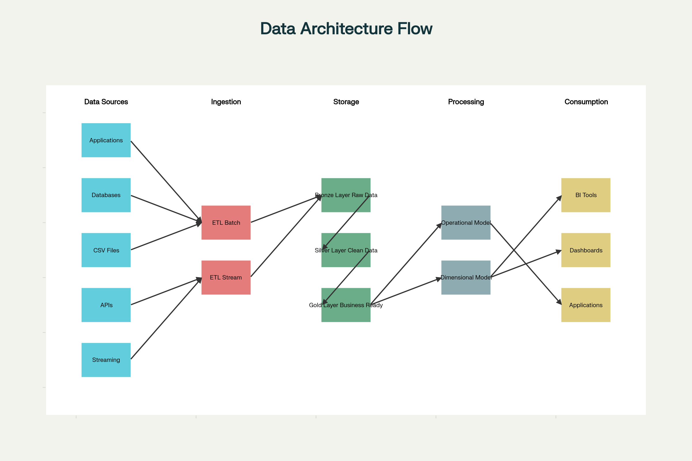

# Case Study

## Architectural design

## VS Code Statements

### Method 1: Using VS Code GUI (Easiest)
1. Switch to the dev branch using the branch indicator.
   - In the bottom-left corner, click the current branch name (for example, “main” or “master”).
   - Select “dev” from the dropdown list.
2. Pull the latest changes.
   - Open the Source Control panel (Ctrl+Shift+G).
   - Click the three dots (⋯) and select “Pull”.

### Method 2: Using VS Code Terminal
1. Open a new terminal.
2. Check available branches:
> his shows all local and remote branches -> git branch -a 
> Switch to dev branch -> git switch dev
> Pull latest changes -> git pull origin dev